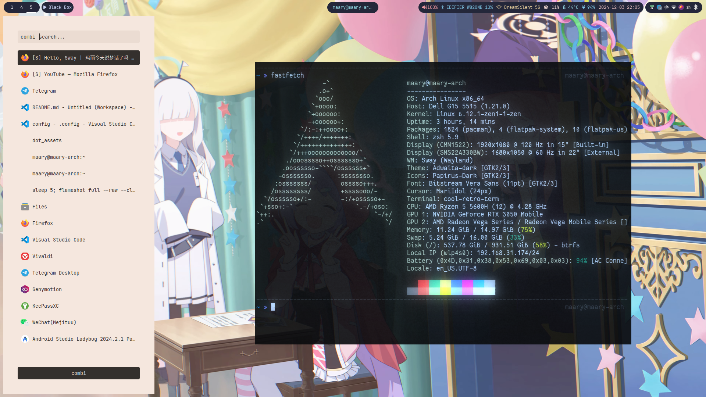

# dotfiles
some dotfiles (like ~~i3-gaps~~ i3, picom, polybar etc)

## preview

  |  |
  | :-------------------------------------: |
  |  |

## Not included repo

1. [autotiling](https://github.com/nwg-piotr/autotiling)
2. [i3-new-workspace](https://github.com/mivort/i3-new-workspace)
3. [i3-scratch-list](https://github.com/draxil/i3-scratch-list) (Need to put i3-scratch-list to ```$bin``` folder like ```/usr/bin/```)
4. [mpv-osc-morden](https://github.com/maoiscat/mpv-osc-modern) 
5. [FluentDark-fcitx5](https://github.com/Reverier-Xu/FluentDark-fcitx5)
